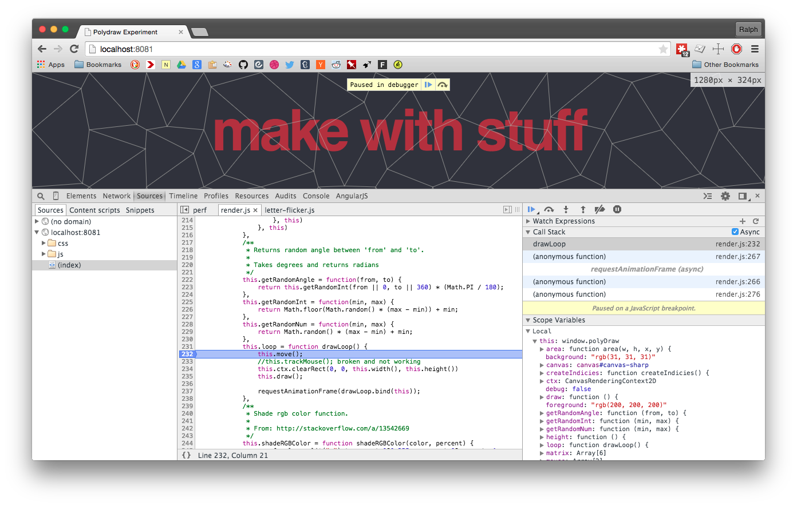

Title: Debugger-First JS Development
Date: 2015-05-11 20:10
Modified: 2015-05-11 20:20
Category: FED
Tags: javascript, fed-tooling
Slug: debugger-first-dev
Authors: Ralph Saunders
Summary: ## Javascript has state of the art debugging tools that are installed at the machine you happen to be next to. Use them.

When I first started writing javascript it was like any other language. I’d
have my trusty text editor and a browser with two tabs - one with the page I
was working on and the other with [MDN](https://developer.mozilla.org/en-US/).

Now it looks more like this:

    
    <figcaption>
        Javascript is the only language I know with state of the art debugging and
        analysis tools that are very likely installed at the machine you happen to be
        sitting at.
    </figcaption>

 Despite this, I still see  developers writing things like
`console.log(i + ‘ items’)`, and
`console.log($(‘.some-element’).outerHeight())` &mdash; seemingly unaware of
the wondrous tools that come installed with the browsers they use every day.

Could you be using web inspector better?

If you find yourself doing any of these, it’s likely you could be using web
inspect better:

- `console.log()`ing variables ad nauseam.
- Guessing at variable and function names.
- Making lots of small code changes resulting in back and forth between browser
  and code until it’s right.
- Experimenting/playing in a text editor vs interactive console.

## Using web inspector

[Chrome DevTools](https://developer.chrome.com/devtools) is an amazingly powerful and in-depth piece of software, so I suggest you invest some time looking at the guide (it’s a really good guide!). Instead I’m going to talk about your new favourite statement:

    debugger;

Here’s how to use it:

1. Stick that anywhere in your code where you want stuff to stop.
2. Reload the page with web inspector open.

You’ll end up with a big panel of code in the middle of your screen. It isn’t there to look pretty - not only can you modify, save, and re-run the code; you can also evaluate any expression by highlighting, right-clicking, and selecting ‘evaluate in console’.

There’s some other panels too:

__Call Stack__ - a list of functions inside the current stack that have been called up until your debugger statement. You can move around freely in your program by clicking these.

__Scope Variables__ - variables that are available in the current scope. This allows you to see what data you’ve got at your disposal.
 
__Console__ - you can also bring up an interactive console by hitting your `escape` key &mdash; allowing you to combine any of your local variables with whatever javascript you want.

That’s it - a fully interactive environment to play/experiment/test with at your disposal. To take this to the next level, you can save all your changes locally when you setup [workspaces](https://developer.chrome.com/devtools/docs/workspaces).